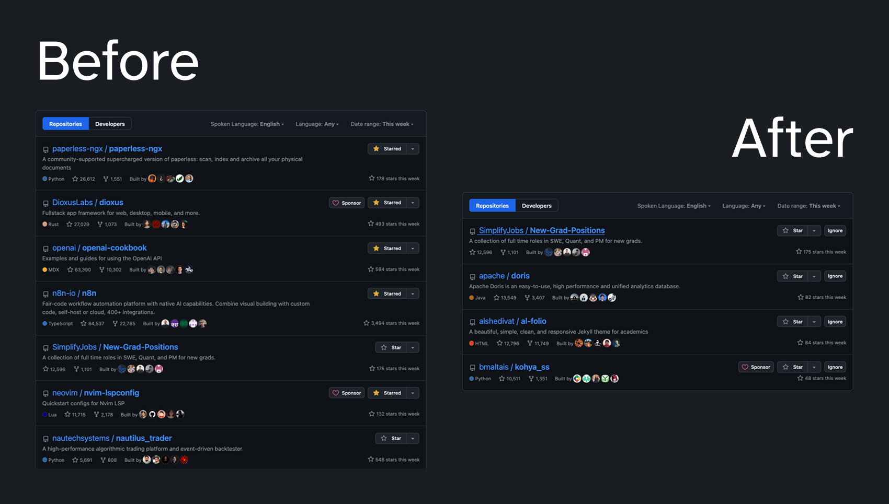

# GitHub: Undiscovered Trending

> Hide starred repos in trending and remove slob

## Install

https://raw.githubusercontent.com/shiftgeist/userscripts/refs/heads/main/github-undiscovered-trending/userscript.js

## Setup

After installation head to https://github.com/trending

Stared repositories are hidden, ignore repositories and hide keywords like "AI" to not show up at all (edit extension source code).
